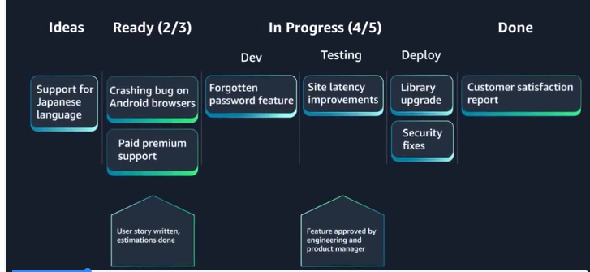

# Kanban: Marco Ágil Visual de Gestión

**Kanban** es una palabra japonesa que significa *“tablero de señales”*.  
Es un marco ágil visual que ayuda a gestionar el flujo de trabajo y a tomar decisiones basadas en la capacidad real del equipo.

Se originó en **Toyota Manufacturing** en los años 1950 y comenzó a aplicarse en desarrollo de software en los años 2000.

---

# Elemento Central: El Tablero Kanban

El tablero es la pieza clave del sistema.

## 📊 Componentes principales

### 1️⃣ Columnas
Representan las etapas del flujo de trabajo.

Ejemplo:
- Ideas
- Listo para construir
- En curso
- Hecho

---

### 2️⃣ Tarjetas
Representan las tareas.

Cada tarjeta:
- Se mueve de izquierda a derecha.
- Refleja el estado actual del trabajo.
- Es completamente visible para todo el equipo.

---

### 3️⃣ Límites de Trabajo en Curso (WIP Limits)

Cada columna tiene un número máximo de tareas permitidas.

Esto:
- Evita la sobrecarga.
- Expone cuellos de botella.
- Obliga al equipo a terminar antes de empezar más.

Si una tarjeta no puede avanzar por el límite, se marca visualmente (por ejemplo, con un indicador rojo) para señalar un bloqueo.

---

### 4️⃣ Políticas de “Hecho”

En la parte inferior de cada columna se define:

- Qué condiciones deben cumplirse
- Cuándo una tarea puede avanzar

Esto mejora la claridad y reduce ambigüedades.

---

# Modelo Pull

Kanban funciona bajo un modelo **pull**:

- No se asigna trabajo por adelantado.
- El miembro del equipo toma una tarea cuando tiene disponibilidad.
- El tablero indica claramente qué está listo para comenzar.

---

# Roles en Kanban

Kanban no impone roles específicos.

Opciones comunes:

- Ingeniero de software
- Product manager
- QA
- DevOps

Recomendación:
- Si el equipo ya existe, mantener los roles actuales.
- Ajustarlos después de evaluar el flujo de trabajo.

---

# Métricas en Kanban

## ⏱️ 1. Tiempo de Ciclo (Cycle Time)

Es el tiempo que tarda una tarjeta en recorrer el flujo completo.

Sirve para:
- Detectar cuellos de botella.
- Mejorar eficiencia.
- Ajustar límites de WIP.

Las tareas pueden estimarse por tamaños relativos:
- XS
- S
- M
- L

---

## 📈 2. Rendimiento (Throughput)

Cantidad de trabajo entregado en un período determinado.

Ejemplo:
- ¿Cuántas tarjetas completamos este mes?

Permite evaluar productividad real del equipo.

---

# Kanban vs Scrum

| Scrum | Kanban |
|-------|--------|
| Trabaja en sprints | Flujo continuo |
| Compromiso fijo por sprint | Decisiones en cualquier momento |
| Planificación formal | Autoasignación dinámica |
| Iteraciones estructuradas | Flujo adaptable |

---

# Scrumban: Combinación de Ambos

Algunos equipos combinan:

- Iteraciones de Scrum
- Tablero y límites WIP de Kanban

Esto se conoce como **Scrumban**.

Es útil para:
- Transición entre marcos
- Equipos que prefieren estructura ligera + flujo continuo

---

# Principios Fundamentales de Kanban

- Transparencia total
- Visualización del trabajo
- Retroalimentación continua
- Mejora progresiva
- Adaptabilidad al cambio

---

# En Resumen

Kanban ofrece:

- Simplicidad
- Visibilidad inmediata del estado del trabajo
- Control del flujo mediante límites WIP
- Flexibilidad sin imponer estructuras rígidas

Es especialmente útil en entornos dinámicos donde el trabajo cambia constantemente y se necesita máxima adaptabilidad.

---

Con esto, ya tienes una visión clara de los tres niveles:

- 🌐 Agile (filosofía)
- 🏉 Scrum (iterativo con roles definidos)
- 📊 Kanban (flujo continuo y visual)

Cada equipo puede adoptar, adaptar o incluso combinar estos enfoques según sus necesidades.
